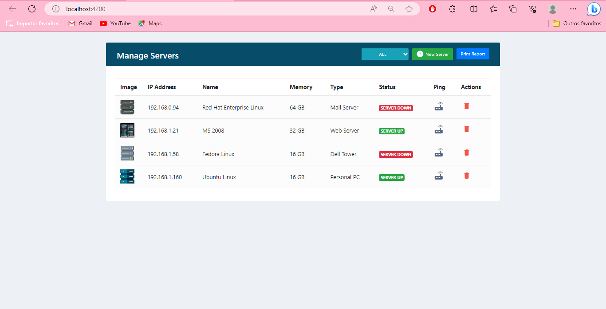
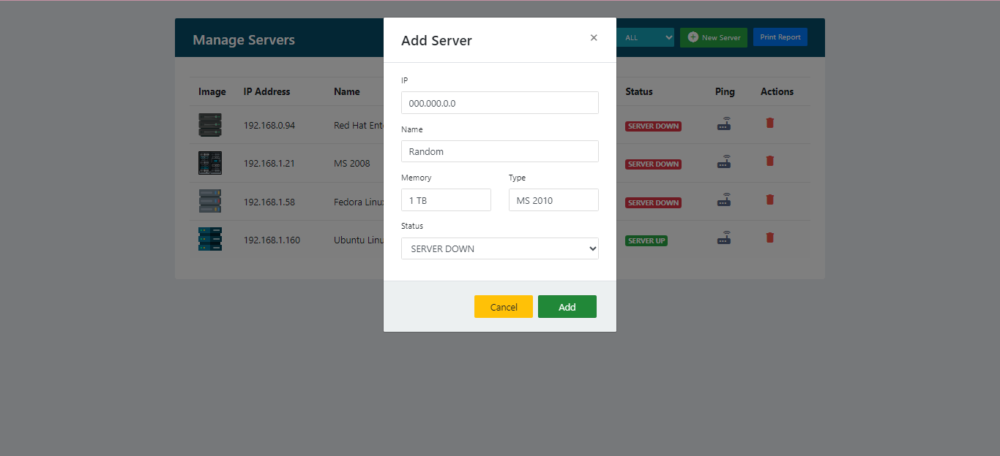
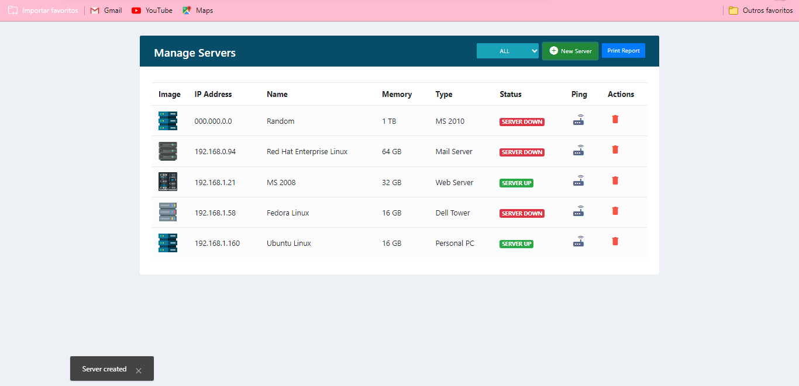
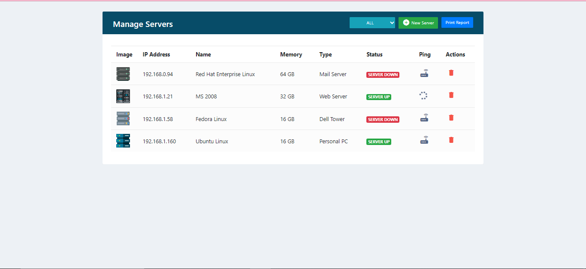
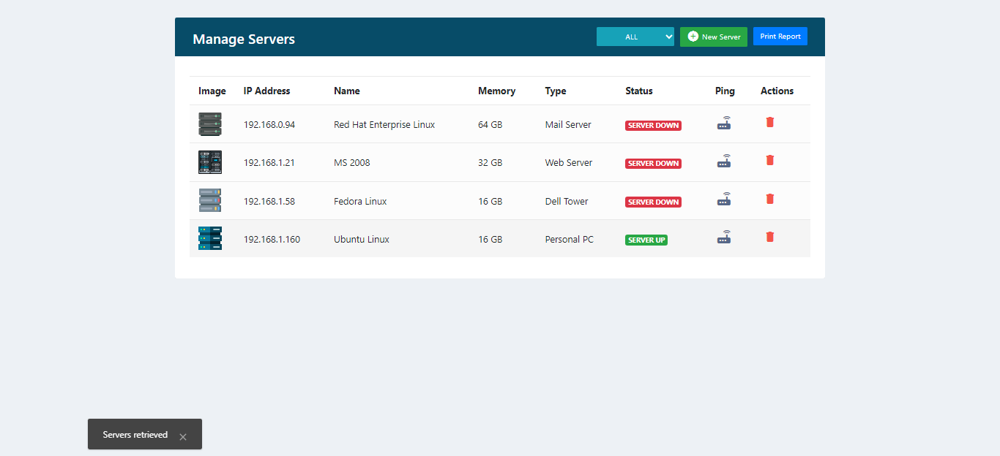
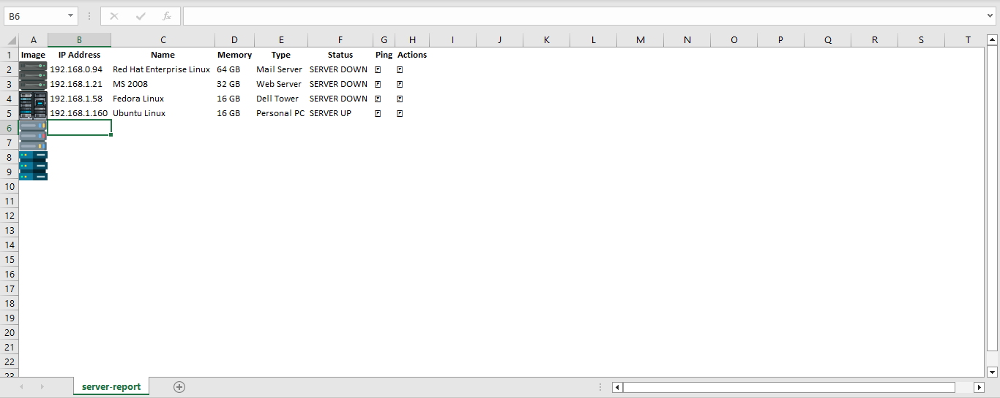

# Back-end repository: 
<a href="https://github.com/CassRamos/server_app_backend" target="_blank"> Click here to check out the Java back-end of this project</a>

<br>
<br>

<h1 align="center"> Server manager </h1>
<p align="center">
  
</p>

<p align="center">
This repository is a front-end file of server_app application<br/>
</p>

<p align="center">
  <a href="#-tecnologies">Tecnologies</a>&nbsp;&nbsp;&nbsp;|&nbsp;&nbsp;&nbsp;
  <a href="#-project">Project</a>&nbsp;&nbsp;&nbsp;|&nbsp;&nbsp;&nbsp;
  <a href="#memo-license">License</a>
</p>
<p align="center">
  
</p>


<br>

## 🚀 Tecnologies

This project was developed with the following technologies:

- JavaScript & Angular
- Html & CSS
- TypeScript
- Node.js
- Git & Github 
 


## 💻 Project
This project is responsible for promoting a server management interface, with basic functions create, edit, delete (CRUD) & ping functionality.

<br>

## Application breakdown 🔥


### Creating server
 - Here is an example for creating a server:
<p align="center">
  
</p>

- after create server:

<p align="center">
  
</p>

<br>

### Pinging server
  - Here is an example for pinging a server:
<p align="center">
  
</p>

  - After ping, there was no response from server, so the status is modified to down:
<p align="center">
  
</p>

  - To create a server that returns a response to the ping, use your ip address. Open your cmd and type:
    ```
      ipconfig
    ```
  - Copy your address and use it in the server creation form

<br>

### Report
This app provides an excel report from the list of servers, to run this feature follow the explanations below

 - To generate a report, just click in the "Print Report" button and the following will be displayed on your interface:
<p align="center">
  
</p>

- After opening the downloaded file, something like the following report will be displayed
<p align="center">
  
</p>

<br>

<p>Thanks for your attention, see you next time 💜</p>

## :memo: License

This project is under license from MIT

<br>


# Serverapp

This project was generated with [Angular CLI](https://github.com/angular/angular-cli) version 16.0.2.

## Development server

Run `ng serve` for a dev server. Navigate to `http://localhost:4200/`. The application will automatically reload if you change any of the source files.

## Code scaffolding

Run `ng generate component component-name` to generate a new component. You can also use `ng generate directive|pipe|service|class|guard|interface|enum|module`.

## Build

Run `ng build` to build the project. The build artifacts will be stored in the `dist/` directory.

## Running unit tests

Run `ng test` to execute the unit tests via [Karma](https://karma-runner.github.io).

## Running end-to-end tests

Run `ng e2e` to execute the end-to-end tests via a platform of your choice. To use this command, you need to first add a package that implements end-to-end testing capabilities.

## Further help

To get more help on the Angular CLI use `ng help` or go check out the [Angular CLI Overview and Command Reference](https://angular.io/cli) page.
